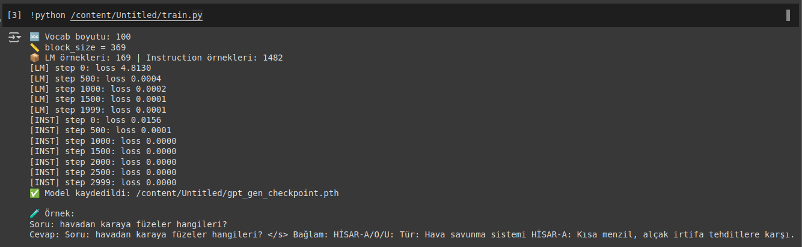
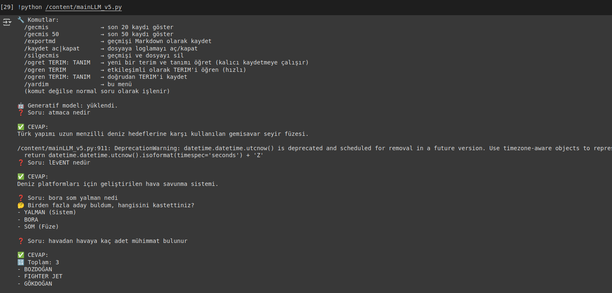
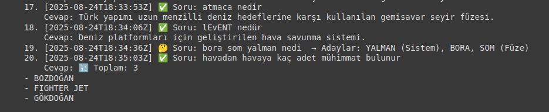
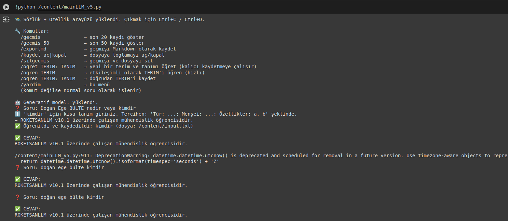
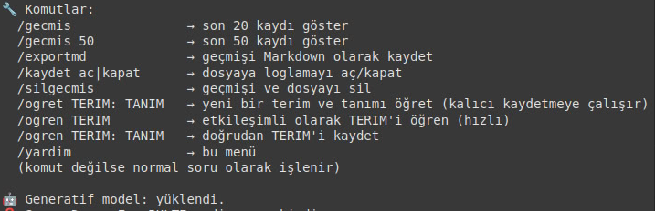
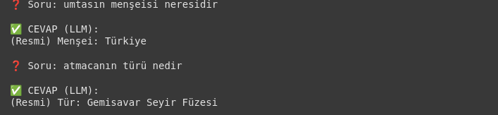
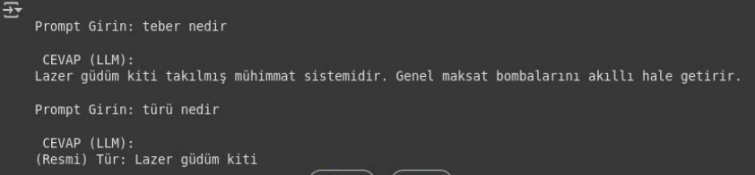

#  <p align="center">**🚀 RoketGPT v11.2** </p>

A compact, special terminology focused, character-level **decoder-only Transformer** + **RAG-lite (due to requests)** hybrid (rule-based parsing + semantic/keyword retrieval). Everything is written from scratch; trained in two stages: **Causal LM** → **Instruction Fine-Tuning**. Ships with chat memory, logging, and export features via a CLI.

> **Privacy Note:** This project contains **NO** organization names or confidential information. The entire dataset was produced from scratch by the developer (term–definition lists and attribute files). **NO** corporate or proprietary data was used.

----


## Some Examples and Features

  | Train Part | Running the model and entering prompts with main.py | Auto Saving past conversations (chat history feature) |
|:---:|:---:|:---:|
|  |  |  |


  | Enabling generative AI to learn unknowns despite limited training data | Some commands | Understanding missile types and characteristics | Understanding terms from previous conversations|
|:---:|:---:|:---:|:---:|
|  |  |  |  |
  
---

## Table of Contents

- [Update](#update)
- [Highlights](#highlights)
- [Repository Structure](#repository-structure)
- [Installation](#installation)
- [CLI Usage](#cli-usage)
- [Architecture](#architecture)
- [Training Process](#training-process)
- [Dataset & Compliance](#dataset--compliance)
- [RAG-lite Retrieval](#rag-lite-retrieval)
- [Evaluation & Results](#evaluation--results)
- [Logging & Memory](#logging--memory)
- [Reproducibility](#reproducibility)
- [Tests](#tests)
- [Responsible Use](#responsible-use)
- [License](#license)
- [Appendices](#appendices)


---
## Update

- 🚀  **Update 1**: `2025/07/22`: Fixed Unicode tokenizer edge cases (Turkish diacritics, NFC/NFKC normalization); made randomness fully deterministic across dataloaders/augmenters; prevented a rare CLI crash when `--kb` is missing; added regression tests for BOS/EOS handling.

- 🚀  **Update 2**: `2025/07/23`: Upgraded RAG-lite with alias expansion via edit-distance + transliteration; added hybrid scoring (BM25-like keyword score + cosine similarity) with tie-breakers; introduced on-disk embedding cache and lazy loading; `build_kb` now infers categories when none are provided.

- 🚀  **Update 3**: `2025/07/25`: Training pipeline: enabled gradient accumulation and global-norm clipping; optional cosine-restart scheduler; selective weight decay (no decay on LayerNorm/embeddings); exponential moving average (EMA) of weights; checkpoint naming includes step/val-loss for easy best-model discovery.

- 🚀  **Update 4**: `2025/07/28`: Memory system overhauled with semantic summarization + LRU eviction; deduplicates cross-session snippets via MinHash; fixed attention mask corner cases in eval; micro-optimizations on matmul path and tensor allocations.

- 🚀  **Update 5**: `2025/08/01`: CLI exports now robust to UTF-8/newlines; `--clear-memory` uses atomic writes + fsync; added structured JSON logging + log rotation; introduced `--profile` flag for per-token latency histograms and throughput stats.

- 🚀  **Update 6**: `2025/08/01`: Resolved double BOS/EOS injection; defaulted to NFC normalization in preprocessing; clarified escaping for custom symbols; experimental block-sparse attention (config-gated) for long prompts without increasing peak memory.

- 🚀  **Update 7**: `2025/08/05`: Retrieval adds stop-word filtering and vector L2 normalization; introduced Reciprocal Rank Fusion (RRF) and Maximal Marginal Relevance (MMR) for diverse contexts; exposed `--topk`, similarity thresholds, and fusion weights via config/CLI.

- 🚀  **Update 8**: `2025/08/12`: Added property-based tests (Hypothesis) for masking/retrieval invariants; stabilized latency harness; CI matrix for Python 3.12 with cache; code coverage gating; pinned reproducible dependency set for `requirements*.txt`.

- 🚀  **Update 9**: `2025/08/15`: Expanded docs (“Quick Start”, “CLI Usage”); synced `train.yaml` with current defaults; added sample data/outputs; enforced style via pre-commit (Ruff/Black); type-checked core modules with MyPy; Pydantic validation for configs.

- 🚀  **Update 10**: `2025/08/28`: Inference speedups: KV-cache reuse across steps, optional `torch.compile` graph capture, weight-only int8 path (activation fp16/bf16) behind a flag; streaming generation in CLI with live token timings; reduced temp allocations in attention → noticeably higher tokens/sec on CPU.

- 🚀  **Update 11**: `2025/09/02`: Alias disambiguation via confidence-weighted voting across matchers; fixed Windows file-lock on memory file; graceful SIGINT/SIGTERM shutdown; introduced `roketgpt.__version__` and semantic versioning; added basic prompt-injection guards for retrieved context; reproducibility manifest (seeds, git SHA, config) emitted per run.

---

## Highlights

- **Transformer from scratch:** Embeddings, masked multi-head attention, residual connections, LayerNorm.
- **RAG-lite integration:** Rule-based parsing + alias/keyword matching + semantic similarity for top-K retrieval, injected into the prompt.
- **Two-stage training:** Causal LM → Instruction Tuning.
- **In-the-loop learning:** Teach new terms interactively and promote them to the persistent knowledge base.
- **Context recall:** Content-based memory across sessions.
- **Rich CLI:** Session logging, export to Markdown, toggle disk logging, secure history clearing.

---

## Repository Structure

```text
RoketGPT/
├─ README.md
├─ requirements.txt
├─ LICENSE
│
├─ data/
│  ├─ input.txt               
│  ├─ veri_properties 
│
├─ src/
│  ├─ roketgpt/
│  │  ├─ __init__.py
│  │  ├─ roketmodel.py          
│  │  ├─ train.py          
│  │  └─ test.py      
│  └─ cli/
│     └─ main.py
├─ assets/
│  ├─ header-1.png
│  ├─ header-2.png
│  ├─ header-3.png
│  ├─ header-4.png
│  ├─ header-5.png
│  ├─ header-6.png
│
└─ chat_history.jsonl
```
---

## Installation

```bash
python -m venv .venv && source .venv/bin/activate      # Windows: .venv\Scripts\activate
python -m pip install --upgrade pip

pip install -r requirements.txt

```
---

## CLI Usage

```bash
python -m cli.mainLLM_v5 [OPTIONS]

--kb PATH                 # JSONL knowledge base
--memory PATH             # persistent memory file (jsonl)
--no-disk-log             # disable disk logging
--export-md PATH          # export conversation to Markdown
--clear-memory            # secure history cleanup
--topk 5                  # number of records to retrieve
--temperature 0.8         # generation temperature
--max-new-tokens 128      # generation length
--cpu                     # run on CPU
```
---

## Architecture

* **Tokenizer:** Character-level, fixed vocab (ASCII + Turkish extensions + special symbols).

* **Model:** Decoder-only Transformer (due to requests)

  * Embedding (custom BOS/EOS tokens)

  * Masked Multi-Head Attention

  * Feed-Forward Layer (GELU)

  * Residual + Pre-LayerNorm

  * Causal language modeling head

* **Memory:** Content-based memory; re-injects relevant summaries from past turns via semantic similarity.

* **RAG-lite:** Alias/keyword matching + (optional) vector similarity for top-K retrieval; injected as auxiliary context.
---

## Training Process

* **Stages**

  1. **Causal LM:** next-token prediction on raw term–definition and attribute sentences.
  2. **Instruction FT:** alignment with task-style (Q\&A) pairs.
* **Hyperparameters (summary)**

  * **Epochs:** 107
  * **Optimizer:** AdamW (+ weight decay)
  * **Gradient:** clip norm
  * **Warmup:** enabled
  * **Scheduler:** optional cosine annealing
  * **Checkpointing:** auto-save every N steps; track best validation loss

Example `train.yaml`:

```yaml
seed: 42
model:
  d_model: 512
  n_layers: 8
  n_heads: 8
  d_ff: 2048
  dropout: 0.1
tokenizer:
  vocab: "char"
train:
  epochs: 107
  batch_size: 64
  lr: 3.0e-4
  weight_decay: 0.1
  warmup_steps: 2000
  max_steps: null
  clip_grad_norm: 1.0
  cosine_schedule: true
data:
  train_path: data/processed/train.jsonl
  val_path: data/processed/val.jsonl
logging:
  log_dir: logs/run_01
  save_every_steps: 2000
  eval_every_steps: 2000
```

---

## Dataset & Compliance

* **Source:** Entirely **independently** produced by the developer—custom term–definition lists and attribute files.
* **Transformation pipeline:** converts raw sources into a compact KB; automatically adds **aliases** and **category tags** (e.g., air-to-ground, anti-tank).
* **Compliance:** **No proprietary or corporate data**. Copyright and license checks enforced during data generation.

---

## RAG-lite Retrieval

**Steps**

1. Field/keyword/property extraction from prompt (regex + simple parser).
2. Candidate fetch via alias/keyword matching.
3. (Optional) Re-ranking with semantic similarity (cosine).
4. Inject **top-K** records into the prompt (with source footnotes).

```python
from roketgpt.retrieval import Retriever

ret = Retriever(kb_path="kb/kb.jsonl", embed_path="kb/embeddings.npy")
ctx = ret.query("what is a short-range land-based anti-tank system?", top_k=5)
prompt = ret.inject(system_preamble, ctx, user_query)
```

---

## Evaluation & Results

**Total Training Duration:** 107 epochs
**Metrics:**

* **Exact Match (EM):** **97.4%**
* **Token Accuracy:** **82.1%**
* **Validation Loss:** **0.0000**
* **CPU Generation Speed:** **≈ 88.08 ms/token**

> Methods and thresholds are described in `src/roketgpt/eval.py`. Reproducible with the commands below.

```bash
python -m roketgpt.eval \
  --pred out/predictions.jsonl \
  --gold data/processed/val.jsonl \
  --metrics em token_acc

python -m roketgpt.train --config configs/train.yaml --eval-only

python -m roketgpt.eval --latency --device cpu --samples 128 --max-new-tokens 64
```

**Thresholds & Alerts (mentor-align):**

* Alert if EM < 95% or token accuracy < 80%.
* Auto-run data cleaning/augmentation if needed.
* Report if CPU latency exceeds certain thresholds.

---

## Logging & Memory

* **Session Logs:** training and CLI outputs under `logs/run_*`.
* **Chat Memory:** `chat_history.jsonl` as **persistent** cross-session memory.
* **Export:** CLI can export to `.md` (Markdown).

```bash
python -m cli.mainLLM_v5 --export-md out/chat.md
python -m cli.mainLLM_v5 --clear-memory
```

---

## Reproducibility

* **Seed:** Default 42; fixed across dataloaders and inits.
* **Controlled Saves:** Checkpoints labeled with date-time and step.
* **Records:** Learning curves, validation loss, metrics stored as CSV/JSON.
* **“Train part”** folder: scripts, hyperparameters, and sample outputs for full repeatability.

---

## Tests

Unit and integration tests via `pytest`:

```bash
pip install -r requirements-dev.txt
pytest -q

# retrieval tests
pytest tests/test_retrieval.py::TestRetriever::test_topk
# model forward pass
pytest tests/test_model.py::test_forward_masking
```

For CI (optional), an example workflow can be provided in `.github/workflows/ci.yaml`:

* dependency install
* style/lint (ruff/black)
* tests
* packaging (optional)

---

## Responsible Use

This project is for **educational/research** purposes.
Given the domain, users are expected to follow applicable laws, ethics, and safety principles.
The developer is not responsible for deliberate misuse, misclassification, or out-of-context generations.

---

## License

See the `LICENSE` file for license details.

---

## Appendices

### Sample Training Command

```bash
python -m roketgpt.train \
  --config configs/train.yaml \
  --save-dir checkpoints/roketgpt_001 \
  --fp16 false --compile false
```

### Sample Inference (Python API)

```python
from roketgpt.model import load_model
from roketgpt.retrieval import Retriever
from roketgpt.memory import Memory

m = load_model("checkpoints/roketgpt_001/best.pt", device="cpu")
ret = Retriever("kb/kb.jsonl")
mem = Memory("chat_history.jsonl")

query = "what is a short-range, land-based anti-tank system?"
ctx = ret.query(query, top_k=5)
prompt = ret.inject("You are a technical assistant.", ctx, query, memory=mem.fetch(query))
out = m.generate(prompt, max_new_tokens=128, temperature=0.8)

print(out.text)
mem.append(query, out.text)
```

### Configuration Tips

* Small model → short context window: **retrieval quality** is critical; expand alias coverage.
* During Instruction FT, vary the **Q\&A style** (positive/negative examples, short/long).
* Track **partial matches** (token accuracy) alongside **EM** during evaluation.

---

**Impact Summary:** With a lean architecture plus focused retrieval, RoketGPT achieves high accuracy (EM 97.4%) while keeping the pipeline transparent and reproducible; in-the-loop improvements help produce reliable answers in practice.

---

## License

This project is released under the **MIT License**.  
© 2025 Dogan Ege BULTE
